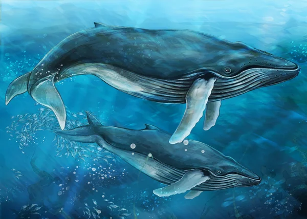

# p2
He realizado mi pagina web sobre ballenas. En ella he incluido 4 ventanas: la principal, la de la ballena azul, la de la ballena jorobada, la de la ballena franca, y un pequeño formulario. Ademas he añadido una pequeña funcionalidad con javascript que simplemente es un boton que cuando le pulsas cambia el color de la pagina web a oscuro, cambiando tambien color de las letras para que se pueda leer todo correcetamente. 

[Aqui esta mi link a mi pagina web](https://bydelariva78.github.io/p2/)
